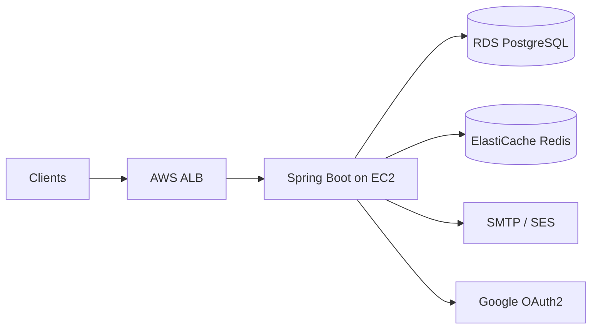

# Tourist Places API

REST backend for discovering countries, tourist destinations, activities, and reviews—with JWT auth, Google OAuth2, and AWS-ready Docker deploy on EC2 + RDS.

[](https://openjdk.org/)
[](https://spring.io/projects/spring-boot)

---

## Table of contents

- [About](#about)
- [Features](#features)
- [Documentation](#documentation)
- [Tech stack](#tech-stack)
- [Architecture at a glance](#architecture-at-a-glance)
- [Prerequisites](#prerequisites)
- [Quick start](#quick-start)
- [Configuration](#configuration)
- [API overview](#api-overview)
- [Project structure](#project-structure)
- [Deployment](#deployment)
- [Testing](#testing)
- [Maintaining documentation](#maintaining-documentation)
- [Contributing](#contributing)
- [Security & compliance](#security--compliance)
- [License](#license)

---

## About

Tourist Places API is a Spring Boot REST service for travel and tourism applications. It exposes countries, place categories, tourist destinations, activities, reviews, and user-curated place lists behind JWT authentication—with optional Google OAuth2 social login.

The project is designed for **cloud deployment on AWS**: the API runs in Docker on **EC2**, persists data in **Amazon RDS PostgreSQL**, and uses **Redis** (ElastiCache or managed Redis) for activation tokens and JWT blacklisting.

| |                                                                               |
|---|-------------------------------------------------------------------------------|
| **Version** | 1.0.0 |                                                                        |
| **Status** | stable                                                                        |
| **Primary API prefix** | `/v1/api/`                                                                    |
| **Auth prefix** | `/auth/`                                                                      |
| **OpenAPI (Swagger)** | [http://localhost:8080/swagger-ui.html](http://localhost:8080/swagger-ui.html) |

---

## Features

Short list for the README; full detail lives in generated docs.

- Browse countries, tourist places, categories, activities, and reviews (public GET)
- JWT signup/login, account activation, password reset, and Google OAuth2
- User place lists and personal review management
- Flyway migrations on PostgreSQL with JPA validation
- Docker image for EC2 with external RDS and Redis

See [Project Features](docs/generated/ProjectFeature.md) for the complete feature breakdown.

---

## Documentation

This repository keeps **structured source** in `docs/source/` (YAML frontmatter + notes) and **human-readable docs** in `docs/generated/`, produced by `docs/yaml_to_markdown.py`. The TypeScript contract for portfolio tools is `docs/source/schema.ts`.

### Documentation index

| Document | What you will find | Read |
|----------|-------------------|------|
| **Overview** | Problem, solution, metrics, links | [ProjectOverview.md](docs/generated/ProjectOverview.md) |
| **Metadata** | Project id, version, tech stack, URLs | [ProjectMetadata.md](docs/generated/ProjectMetadata.md) |
| **API schema** | Endpoints, auth, rate limits, examples | [APISchema.md](docs/generated/APISchema.md) |
| **Architecture** | Layers, patterns, diagram, data flows | [ProjectArchitecture.md](docs/generated/ProjectArchitecture.md) |
| **Infrastructure** | Docker, EC2, RDS, Redis, cloud services | [ProjectInfrastructure.md](docs/generated/ProjectInfrastructure.md) |
| **Features** | Feature cards, snippets, status per area | [ProjectFeature.md](docs/generated/ProjectFeature.md) |
| **Code showcase** | Curated code examples from the codebase | [ProjectCodeShowCase.md](docs/generated/ProjectCodeShowCase.md) |
| **Generated index** | Auto-generated hub linking all of the above | [docs/generated/README.md](docs/generated/README.md) |

### Source vs generated

| Path | Purpose |
|------|---------|
| `docs/source/*.md` | Edit YAML frontmatter here (machine-friendly, matches `schema.ts`) |
| `docs/generated/*.md` | Read here on GitHub / in the IDE (do not edit by hand) |
| `docs/yaml_to_markdown.py` | Regenerates `docs/generated/` from `docs/source/` |

```bash
pip install pyyaml
python docs/yaml_to_markdown.py --validate
```

---

## Tech stack

- Java 17
- Spring Boot 3.2.2 (Web, Security, Data JPA, Mail, Cache, OAuth2)
- PostgreSQL + Flyway migrations
- Redis (token blacklist & activation tokens)
- Caffeine (in-process country cache)
- JJWT, MapStruct, ModelMapper
- springdoc-openapi (Swagger UI)
- Maven, Docker

---

## Architecture at a glance

Clients hit an AWS ALB (TLS), which forwards to a Spring Boot container on EC2. The app connects to RDS PostgreSQL for data and Redis for auth tokens. SMTP/SES sends activation emails; Google OAuth2 is optional.



Full diagram, layers, and decisions: [ProjectArchitecture.md](docs/generated/ProjectArchitecture.md).

---

## Prerequisites

- Java 17+
- Maven 3.9+
- Docker & Docker Compose (for container deploy)
- PostgreSQL (local or Amazon RDS in production)
- Redis (local, ElastiCache, or Upstash for token storage)
- Optional: Google OAuth2 credentials for social login

---

## Quick start

### Local development

```bash
git clone https://github.com/alexisTrejo11/tourist-places-api
cd tourist-places-api
cp .env.example .env        # adjust DB_URL, JWT_SECRET, Redis, mail

# Start local PostgreSQL and Redis, then:
./mvnw spring-boot:run
```

- Swagger UI: http://127.0.0.1:8080/swagger-ui.html
- OpenAPI JSON: http://127.0.0.1:8080/v3/api-docs

### Docker (RDS + Redis in cloud)

```bash
cp .env.example .env        # point DB_URL and SPRING_DATA_REDIS_HOST to cloud instances
docker compose up --build -d
```

API on host port **8080**. See [ProjectInfrastructure.md](docs/generated/ProjectInfrastructure.md).

---

## Configuration

Copy `.env.example` to `.env`. Minimum variables for production:

| Variable | Description |
|----------|-------------|
| `SERVER_PORT` | HTTP port (default 8080) |
| `DB_URL` / `DB_USERNAME` / `DB_PASSWORD` | PostgreSQL (Amazon RDS) |
| `JWT_SECRET` | Base64-encoded HMAC secret (min 256 bits) |
| `JWT_ACCESS_EXPIRATION` / `JWT_REFRESH_EXPIRATION` | Token TTL in milliseconds |
| `SPRING_DATA_REDIS_HOST` / `SPRING_DATA_REDIS_PORT` | Redis for tokens & blacklist |
| `GOOGLE_CLIENT_ID` / `GOOGLE_CLIENT_SECRET` / `GOOGLE_REDIRECT_URI` | OAuth2 (optional) |
| `MAIL_*` | SMTP for activation and password-reset emails |

Full list: [.env.example](.env.example).

---

## API overview

| Area | Base path | Doc |
|------|-----------|-----|
| Auth | `/auth/` | [APISchema.md](docs/generated/APISchema.md#auth) |
| Countries | `/v1/api/countries` | [APISchema.md](docs/generated/APISchema.md#countries) |
| Tourist places | `/v1/api/tourist_places` | [APISchema.md](docs/generated/APISchema.md#tourist-places) |
| Place categories | `/v1/api/place_categories` | [APISchema.md](docs/generated/APISchema.md#place-categories) |
| Activities | `/v1/api/activities` | [APISchema.md](docs/generated/APISchema.md#activities) |
| Reviews | `/v1/api/reviews`, `/v1/api/user/reviews` | [APISchema.md](docs/generated/APISchema.md#reviews) |
| User place lists | `/v1/api/user/place-lists` | [APISchema.md](docs/generated/APISchema.md#user-place-lists) |
| Admin users | `/v1/api/users/admin` | [APISchema.md](docs/generated/APISchema.md#users-admin) |

Authentication: `Authorization: Bearer <accessToken>` (JWT). Interactive reference: **Swagger UI** at `/swagger-ui.html`.

---

## Project structure

```
tourist-places-api/
├── src/main/java/at/backend/tourist/places/
│   ├── core/               # Config, exceptions, ResponseWrapper, mail
│   └── modules/            # auth, user, country, places, activity, review
├── src/main/resources/
│   ├── application.yml
│   ├── db/migrations/      # Flyway SQL
│   └── templates/          # Thymeleaf email pages
├── src/test/java/          # Controller & service tests
├── docs/
│   ├── source/             # YAML source docs (edit these)
│   ├── generated/          # Readable Markdown (generated)
│   ├── source/schema.ts    # TypeScript contract
│   └── yaml_to_markdown.py
├── docker-compose.yml
├── dockerfile
├── pom.xml
└── .env.example
```

---

## Deployment

Target architecture: **EC2** runs the Docker container built from `dockerfile` (Maven multi-stage). **Amazon RDS PostgreSQL** holds all relational data (local Postgres is commented out in `docker-compose.yml`). **ElastiCache Redis** (or Upstash) stores JWT blacklist and activation tokens—set `SPRING_DATA_REDIS_HOST` in `.env`. Place an **ALB** with ACM certificate in front of EC2 for HTTPS.

Details: [ProjectInfrastructure.md](docs/generated/ProjectInfrastructure.md).

---

## Testing

```bash
./mvnw test
```

18 test classes cover controllers and services (Auth, Country, Places, Reviews, Activities, Users).

---

## Maintaining documentation

1. Edit YAML in `docs/source/<Section>.md` (keep fields aligned with `docs/source/schema.ts`).
2. Run `python docs/yaml_to_markdown.py --validate`.
3. Commit both `docs/source/` and `docs/generated/` if you want docs visible on GitHub without running the script.

Optional notes that are not part of the schema (warnings, TODOs) go in the **Markdown body** below the closing `---` in each source file—they appear under **Additional notes** in generated files.

---

## Contributing

1. Fork the repository
2. Create a feature branch (`git checkout -b feature/my-change`)
3. Commit with clear messages
4. Open a pull request

Before production deploy: add `@PreAuthorize` for ADMIN mutations, restrict public GET on admin endpoints, and remove JWT debug logging from `JwtAuthenticationFilter`.

---

## Security & compliance

This API handles user accounts and user-generated content. **Do not expose RDS or Redis ports to the public internet.** Use strong `JWT_SECRET`, store secrets in AWS SSM Parameter Store, and enable ALB/WAF rate limiting—application-level rate limiting is not active yet.

Report vulnerabilities privately to the repository owner via GitHub Security Advisories.

---

## License

No LICENSE file in repository yet — add one before public distribution.

---

## Links

| Resource | URL |
|----------|-----|
| Repository | [https://github.com/alexisTrejo11/tourist-places-api](https://github.com/alexisTrejo11/tourist-places-api) |
| Documentation hub | [docs/generated/README.md](docs/generated/README.md) |
| Swagger (local) | [http://localhost:8080/swagger-ui.html](http://localhost:8080/swagger-ui.html) |
